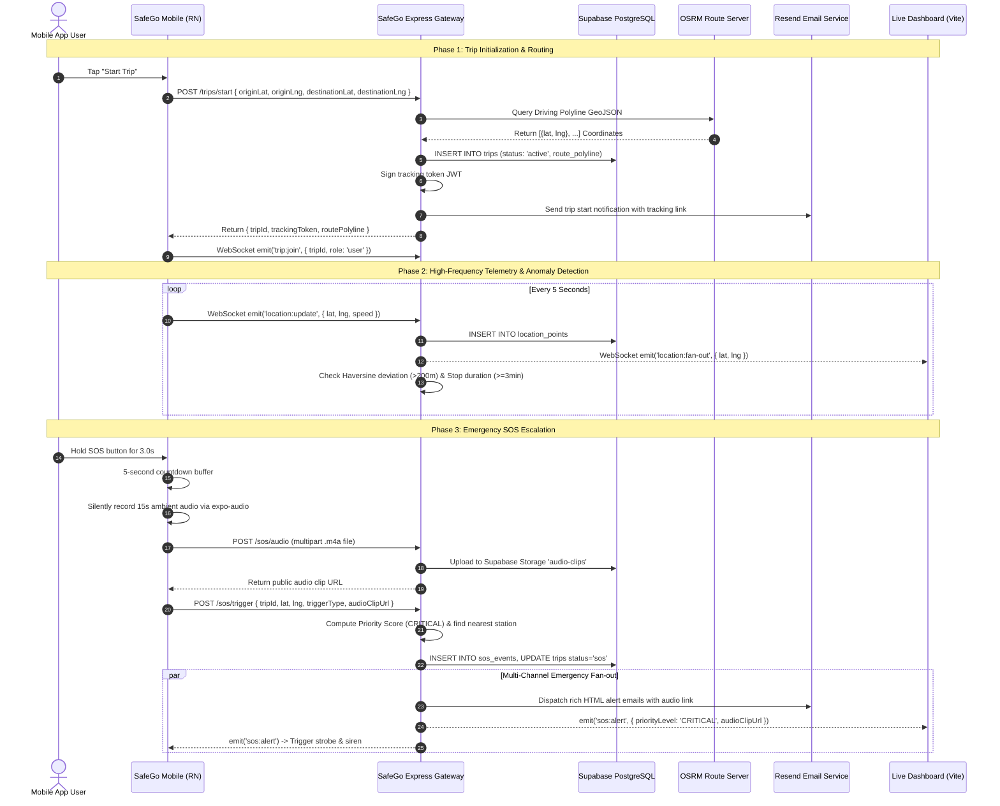

# SafeGo — Real-Time Proactive Personal Safety & Automated Incident Response Platform

An end-to-end personal safety and autonomous transit-monitoring platform designed for high-risk environments. SafeGo combines continuous background GPS telemetry, algorithmic route-deviation and stationary-stop detection, silent ambient audio capture, multi-tiered emergency dispatch (WebSockets, transactional HTML email, and responder webhooks), automated incident priority scoring, and a public, tokenized tracking dashboard.

---

## Table of Contents
1. [Architecture Overview](#1-architecture-overview)
2. [End-to-End Request & Incident Traces](#2-end-to-end-request--incident-traces)
   - [2.1 Active Trip Lifecycle & Telemetry Trace](#21-active-trip-lifecycle--telemetry-trace)
   - [2.2 Emergency SOS Trigger & Multi-Channel Dispatch Trace](#22-emergency-sos-trigger--multi-channel-dispatch-trace)
   - [2.3 Responder Live Tracking & Telemetry Fan-Out Trace](#23-responder-live-tracking--telemetry-fan-out-trace)
3. [Algorithmic Anomaly Detection Pipeline](#3-algorithmic-anomaly-detection-pipeline)
   - [3.1 OSRM Driving Polyline Generation](#31-osrm-driving-polyline-generation)
   - [3.2 Haversine Route Deviation Algorithm](#32-haversine-route-deviation-algorithm)
   - [3.3 Stationary Stop Detection & Check-In State Machine](#33-stationary-stop-detection--check-in-state-machine)
   - [3.4 Priority Scoring Model (NIST-Inspired Risk Tiers)](#34-priority-scoring-model-nist-inspired-risk-tiers)
4. [Client Defense-in-Depth & Safety Utilities](#4-client-defense-in-depth--safety-utilities)
   - [4.1 SOS Orchestration State Machine (`SOSService.ts`)](#41-sos-orchestration-state-machine-sosservicets)
   - [4.2 Silent Ambient Audio Recording & Secure Signed Playback](#42-silent-ambient-audio-recording--secure-signed-playback)
   - [4.3 Simulated Incoming Call Engine (`FakeCallService.ts`)](#43-simulated-incoming-call-engine-fakecallservicets)
   - [4.4 Stroboscopic Screen Flash & Loud Siren Alarm](#44-stroboscopic-screen-flash--loud-siren-alarm)
   - [4.5 Local PIN Verification & Security Interceptor](#45-local-pin-verification--security-interceptor)
   - [4.6 Hierarchical Emergency Services Directory](#46-hierarchical-emergency-services-directory)
5. [Database Schema & Storage Architecture](#5-database-schema--storage-architecture)
   - [5.1 PostgreSQL Table Definitions & Relational Graph](#51-postgresql-table-definitions--relational-graph)
   - [5.2 Supabase Storage Buckets & Access Control (RLS)](#52-supabase-storage-buckets--access-control-rls)
6. [API & WebSocket Protocol Reference](#6-api--websocket-protocol-reference)
   - [6.1 REST API Endpoints](#61-rest-api-endpoints)
   - [6.2 WebSocket (Socket.io) Events & Room Architecture](#62-websocket-socketio-events--room-architecture)
7. [System Data Flow Diagrams](#7-system-data-flow-diagrams)
8. [Known Limitations & Edge Cases](#8-known-limitations--edge-cases)
9. [Installation & Run Guide](#9-installation--run-guide)
   - [9.1 Prerequisites & System Dependencies](#91-prerequisites--system-dependencies)
   - [9.2 Environment Configuration](#92-environment-configuration)
   - [9.3 Step-by-Step Installation & Local Execution](#93-step-by-step-installation--local-execution)
   - [9.4 Automated Test Scripts & Verification Harness](#94-automated-test-scripts--verification-harness)
   - [9.5 End-to-End Manual Testing Walkthrough](#95-end-to-end-manual-testing-walkthrough)

---

## 1. Architecture Overview

```
 ┌────────────────────────────────────────────────────────────────────────────────────────┐
 │                              REACT NATIVE / EXPO MOBILE APP                            │
 │  • Hold-to-Activate SOS Button (3.0s SVG animated ring via Reanimated 4)               │
 │  • Location Streamer (5s GPS interval, Expo Location)                                  │
 │  • Audio Engine: Silent M4A recorder (Expo Audio) + In-App Playback Player             │
 │  • Defense Utilities: Fake Call Simulator, Strobe Siren, PIN Lock, Directory           │
 └────────────────────────────┬───────────────────────────────┬───────────────────────────┘
                              │ HTTP / REST (JWT Auth)        │ WebSocket (Socket.io)
                              │ POST /trips, /sos, /auth      │ location:update, trip:join
                              ▼                               ▼
 ┌────────────────────────────────────────────────────────────────────────────────────────┐
 │                             EXPRESS BACKEND GATEWAY (Node.js)                          │
 │                                                                                        │
 │  ┌──────────────────────────────────────────────────────────────────────────────────┐  │
 │  │ 1. ROUTING & INGESTION CONTROLLERS                                               │  │
 │  │  • Auth & Profile Handler (`routes/auth.js`): bcrypt, JWT, Identity Snapshot    │  │
 │  │  • Trip Coordinator (`routes/trips.js`): OSRM polyline fetch, token generation  │  │
 │  │  • SOS Ingest (`routes/sos.js`): Multer in-memory upload to Supabase Storage    │  │
 │  │  • Directory Resolver (`routes/directory.js`): City -> State -> National match   │  │
 │  │  • Emergency History (`routes/emergencyHistory.js`): 60s signed URL generation  │  │
 │  └──────────────────────────────────┬───────────────────────────────────────────────┘  │
 │                                     ▼                                                  │
 │  ┌──────────────────────────────────────────────────────────────────────────────────┐  │
 │  │ 2. ALGORITHMIC SAFETY & ANOMALY ENGINE                                           │  │
 │  │  • Polyline In-Memory Cache (`socket/handlers.js`): Zero DB read on 5s GPS tick  │  │
 │  │  • Route Deviation Detector (`utils/deviation.js`): Haversine distance > 200m   │  │
 │  │  • Stationary Stop Detector (`utils/stopDetection.js`): 3m stop + 90s countdown │  │
 │  │  • Incident Priority Scoring Engine (`utils/priorityScore.js`): Risk weighting   │  │
 │  │  • Spatial Danger Zone Matcher (`utils/triggerSOS.js` + `utils/nearestStation.js`)│  │
 │  └──────────────────────────────────┬───────────────────────────────────────────────┘  │
 │                                     ▼                                                  │
 │  ┌──────────────────────────────────────────────────────────────────────────────────┐  │
 │  │ 3. MULTI-CHANNEL DISPATCH & FAN-OUT GATEWAY                                      │  │
 │  │  • Socket.io Room Fan-Out: Broadcast to `police-room` & `trip-{id}`             │  │
 │  │  • Transactional Email Engine (`utils/email.js`): Resend API HTML dispatch       │  │
 │  │  • Public Tracking Token Generator (`utils/jwt.js`): Signed JWT tracking URL    │  │
 │  └──────────────────────────────────┬───────────────────────────────────────────────┘  │
 └─────────────────────────────────────┼──────────────────────────────────────────────────┘
                                       │
            ┌──────────────────────────┴──────────────────────────┐
            ▼                                                     ▼
 ┌──────────────────────────────────────┐  ┌──────────────────────────────────────────────┐
 │   DATABASE & CLOUD STORAGE (Supabase)│  │          RESPONDER WEB DASHBOARD (Vite)      │
 │  • PostgreSQL (PostGIS geospatial)   │  │  • OpenStreetMap / Leaflet React Viewer      │
 │  • Tables: users, trips, points, sos │  │  • Public access via `/track/:token` (no login)│
 │  • Storage Buckets: `audio-clips`    │  │  • Real-time breadcrumb trail & status card  │
 │  • Service Key bypasses internal RLS │  │  • Medical card & direct audio playback link │
 └──────────────────────────────────────┘  └──────────────────────────────────────────────┘
```

---

## 2. End-to-End Request & Incident Traces

### 2.1 Active Trip Lifecycle & Telemetry Trace

When a user initiates an active trip on the mobile client:

1. **Permission & Geolocation**: [`LocationService.ts`](file:///Users/althea/Developer/Projects/SafeGoApp/safego-mobile/services/LocationService.ts) verifies foreground location permissions via `expo-location` and fetches high-accuracy coordinates `(originLat, originLng)`.
2. **Trip Creation (`POST /trips/start`)**: [`routes/trips.js`](file:///Users/althea/Developer/Projects/SafeGoApp/safego-backend/routes/trips.js) receives the origin coordinates and optional destination.
3. **OSRM Route Fetch**: The backend queries the public OSRM routing server:
   `http://router.project-osrm.org/route/v1/driving/{lng1},{lat1};{lng2},{lat2}?overview=full&geometries=geojson`
   decodes the coordinate list, and formats it as `[{ lat, lng }, ...]`.
4. **Database Insertion**: A new record is inserted into table `trips` (`status: 'active'`).
5. **Token Generation**: [`utils/jwt.js`](file:///Users/althea/Developer/Projects/SafeGoApp/safego-backend/utils/jwt.js) signs a tracking token containing `{ tripId }` (valid for 24 hours). The `trips` record is updated with `tracking_token`.
6. **Notification to Contacts**: [`utils/email.js`](file:///Users/althea/Developer/Projects/SafeGoApp/safego-backend/utils/email.js) fires an asynchronous notification email via Resend to the user's emergency contacts containing the live URL (`http://<dashboard>/track/<token>`).
7. **WebSocket Room Join**: The mobile client calls `socket.emit('trip:join', { tripId, role: 'user' })`, joining room `trip-{tripId}`.
8. **Periodic Telemetry Loop**: Every 5 seconds, [`LocationService.ts`](file:///Users/althea/Developer/Projects/SafeGoApp/safego-mobile/services/LocationService.ts) emits `location:update` containing `{ tripId, userId, lat, lng, speed, accuracy, timestamp }`.
9. **Zero-Latency In-Memory Ingestion**: [`socket/handlers.js`](file:///Users/althea/Developer/Projects/SafeGoApp/safego-backend/socket/handlers.js):
   - Persists coordinates into table `location_points`.
   - Fans out location update immediately to `police-room` and `trip-{tripId}`.
   - Evaluates route deviation against `polylineCache` via [`utils/deviation.js`](file:///Users/althea/Developer/Projects/SafeGoApp/safego-backend/utils/deviation.js).
   - Evaluates speed against stationary stop threshold via [`utils/stopDetection.js`](file:///Users/althea/Developer/Projects/SafeGoApp/safego-backend/utils/stopDetection.js).

---

### 2.2 Emergency SOS Trigger & Multi-Channel Dispatch Trace

When a panic situation occurs:

1. **Hold-to-Activate Gesture**: The user presses and holds the circular SOS button in [`HomeScreen.js`](file:///Users/althea/Developer/Projects/SafeGoApp/safego-mobile/screens/HomeScreen.js). Reanimated 4 drives the SVG stroke dash offset over `3000ms`.
2. **Countdown Buffer**: Upon completion, [`SOSService.ts`](file:///Users/althea/Developer/Projects/SafeGoApp/safego-mobile/services/SOSService.ts) initiates a 5-second countdown window (`status: 'COUNTDOWN'`) during which the user can cancel accidental triggers.
3. **Silent Audio Recording**:
   - `SOSService` transitions to `status: 'RECORDING'`.
   - [`AudioRecordingService.ts`](file:///Users/althea/Developer/Projects/SafeGoApp/safego-mobile/services/AudioRecordingService.ts) initializes an `expo-audio` recording session at high quality (M4A / AAC).
   - Records ambient audio for 15 seconds without visual or audible cues.
4. **Multipart Audio Upload**:
   - Client sends `POST /sos/audio` with `multipart/form-data` containing the file buffer and `tripId`.
   - [`routes/sos.js`](file:///Users/althea/Developer/Projects/SafeGoApp/safego-backend/routes/sos.js) validates MIME type (`audio/m4a`, `audio/x-m4a`), builds a unique path (`{userId}/sos_{timestamp}.m4a`), and uploads the buffer to the `audio-clips` Supabase bucket.
   - Retrieves public URL: `https://<supabase>/storage/v1/object/public/audio-clips/...`.
5. **SOS Alert Execution (`POST /sos/trigger`)**:
   - Mobile sends payload: `{ tripId, lat, lng, triggerType: 'manual-sos', audioClipUrl, identitySnapshot, location_name }`.
   - [`utils/triggerSOS.js`](file:///Users/althea/Developer/Projects/SafeGoApp/safego-backend/utils/triggerSOS.js) verifies trip ownership.
   - **Danger Zone Detection**: Checks if coordinates fall inside any configured `danger_zones` geofence radius.
   - **Priority Score Computation**: [`utils/priorityScore.js`](file:///Users/althea/Developer/Projects/SafeGoApp/safego-backend/utils/priorityScore.js) evaluates trigger type, time of day, danger zone status, and velocity to assign a numeric score and tier (`CRITICAL`, `HIGH`, `MEDIUM`).
   - **Nearest Police Station**: [`utils/nearestStation.js`](file:///Users/althea/Developer/Projects/SafeGoApp/safego-backend/utils/nearestStation.js) queries all stations in table `police_stations` and computes closest Euclidean/Haversine distance.
   - **Database Commit**: Inserts incident into `sos_events` and updates `trips.status = 'sos'`.
6. **Multi-Channel Dispatch**:
   - **Email Dispatch**: [`utils/email.js`](file:///Users/althea/Developer/Projects/SafeGoApp/safego-backend/utils/email.js) sends customized HTML alert emails to all configured emergency contacts via Resend. Emails contain 1-click telephone dialers, Google Maps navigation links, live tracking dashboard links, and the audio evidence link.
   - **WebSocket Broadcast**: Emits `sos:alert` to `police-room` and `trip-{tripId}` with full incident payload.
7. **Client Alert State**: Mobile transitions to `status: 'ACTIVE'`, triggering the continuous loud siren and screen flash overlay (if enabled in preferences).

---

### 2.3 Responder Live Tracking & Telemetry Fan-Out Trace

When a contact clicks the tracking link (`/track/<token>`):

1. **Token Verification**: [`routes/track.js`](file:///Users/althea/Developer/Projects/SafeGoApp/safego-backend/routes/track.js) decodes and verifies the JWT tracking token without requiring user login.
2. **Incident Snapshot Assembly**: Joins `trips` with `users` (name, phone, blood group, allergies, medications), the latest coordinate from `location_points`, and the active incident from `sos_events`.
3. **Web Client Initialization**: [`LiveTrackingView.jsx`](file:///Users/althea/Developer/Projects/SafeGoApp/safego-dashboard/src/views/LiveTrackingView.jsx) renders the user profile, medical badge, and Leaflet map centered on the last reported point.
4. **Socket Channel Subscription**: Dashboard establishes WebSocket connection and emits `trip:join` with `{ tripId, role: 'watcher' }`.
5. **Real-Time Marker Animation**:
   - As new 5-second GPS updates arrive from the mobile device, the backend broadcasts `location:fan-out`.
   - The dashboard updates the Leaflet marker coordinates with smooth CSS transitions and appends the coordinate to the route breadcrumb trail.
   - If an SOS is fired or resolved, `sos:alert` or `sos:resolved` immediately updates the banner, priority indicator, and ambient audio link in the web UI.

---

## 3. Algorithmic Anomaly Detection Pipeline

```
 ┌────────────────────────────────────────────────────────────────────────┐
 │                      GPS Stream (Every 5 seconds)                      │
 │         { tripId, userId, lat, lng, speed, accuracy, timestamp }       │
 └───────────────────────────────────┬────────────────────────────────────┘
                                     │
                  ┌──────────────────┴──────────────────┐
                  ▼                                     ▼
 ┌─────────────────────────────────┐   ┌─────────────────────────────────┐
 │    Route Deviation Check        │   │    Stationary Stop Detection    │
 │   (`utils/deviation.js`)        │   │   (`utils/stopDetection.js`)    │
 │                                 │   │                                 │
 │ • Reads cached OSRM polyline    │   │ • Checks if speed < 5 km/h      │
 │ • Computes min Haversine dist   │   │ • Tracks duration in tripStates │
 │ • Threshold: > 200 meters       │   │ • Threshold: >= 3 minutes       │
 └────────────────┬────────────────┘   └────────────────┬────────────────┘
                  │                                     │
                  └──────────────────┬──────────────────┘
                                     │ Anomaly Triggered
                                     ▼
 ┌────────────────────────────────────────────────────────────────────────┐
 │                      In-Flight Check-In Prompt                         │
 │      `socket.emit('checkin:prompt', { reason, responseWindowMs: 90s })`│
 └───────────────────────────────────┬────────────────────────────────────┘
                                     │
                  ┌──────────────────┴──────────────────┐
                  ▼                                     ▼
      [User Taps "I'm OK"]                   [90s Timeout Expires]
   `socket.emit('checkin:response')`         `triggerSOS({ ... })`
                  │                                     │
                  ▼                                     ▼
     • Clear autoSosTimers Map               • Priority: CRITICAL
     • Clear tripStates Map                  • Multi-channel SOS dispatch
     • Emit `checkin:confirmed`              • Police & contacts alerted
```

### 3.1 OSRM Driving Polyline Generation
- Implemented in [`safego-backend/routes/trips.js`](file:///Users/althea/Developer/Projects/SafeGoApp/safego-backend/routes/trips.js).
- When destination coordinates are provided at trip start, the backend queries the Open Source Routing Machine (OSRM) driving API:
  $$\text{Query: } \text{driving}/\{\text{originLng}\},\{\text{originLat}\};\{\text{destLng}\},\{\text{destLat}\}?overview=full\&geometries=geojson$$
- Parses the GeoJSON coordinate array and converts it into a typed array of `{ lat, lng }` vertices.
- Stored as `JSONB` in the `trips.route_polyline` column and cached in an in-memory `Map` (`polylineCache`) on the server to prevent database roundtrips during high-frequency location streaming.

### 3.2 Haversine Route Deviation Algorithm
- Implemented in [`safego-backend/utils/deviation.js`](file:///Users/althea/Developer/Projects/SafeGoApp/safego-backend/utils/deviation.js).
- Calculates the spherical distance between current point $(lat_1, lon_1)$ and each polyline vertex $(lat_2, lon_2)$ using the Haversine formula:
  $$d = 2R \cdot \arcsin\left(\sqrt{\sin^2\left(\frac{\Delta lat}{2}\right) + \cos(lat_1)\cos(lat_2)\sin^2\left(\frac{\Delta lon}{2}\right)}\right)$$
  where $R = 6{,}371{,}000\text{ m}$.
- Evaluates minimum distance:
  $$\min_{p \in \text{Polyline}} \text{dist}(\text{currentPoint}, p) > 200\text{ meters}$$
- If the user strays more than 200 meters from all polyline segments, `isDeviating()` returns `true`, triggering an immediate safety check-in.

### 3.3 Stationary Stop Detection & Check-In State Machine
- Implemented in [`safego-backend/utils/stopDetection.js`](file:///Users/althea/Developer/Projects/SafeGoApp/safego-backend/utils/stopDetection.js).
- **Speed Threshold**: `SPEED_THRESHOLD_KMH = 5` km/h.
- **Stop Duration**: `STOP_DURATION_MS = 180,000` ms (3 minutes).
- **Response Window**: `CHECKIN_WINDOW_MS = 90,000` ms (90 seconds).
- **State Management**:
  - `tripStates = new Map()`: Tracks `{ stoppedSince, checkInSent, lastLat, lastLng, userId }` per active `tripId`.
  - `autoSosTimers = new Map()`: Holds active `setTimeout` timers for pending auto-escalations.
- **Resolution**:
  - If vehicle resumes normal speed ($\ge 5\text{ km/h}$), the stop timer is reset.
  - If stationary for $\ge 3$ minutes, a `checkin:prompt` is emitted to the user's mobile app.
  - If the user acknowledges the prompt within 90 seconds, `cancelAutoSos()` clears the timer.
  - If the timer expires without confirmation, `triggerSOS()` is automatically invoked with `triggerType: 'auto-stop'`.

### 3.4 Priority Scoring Model (NIST-Inspired Risk Tiers)
- Implemented in [`safego-backend/utils/priorityScore.js`](file:///Users/althea/Developer/Projects/SafeGoApp/safego-backend/utils/priorityScore.js).
- Computes an objective incident severity score ($0 - 100$):

$$\text{Priority Score} = W_{\text{trigger}} + W_{\text{time}} + W_{\text{zone}} + W_{\text{speed}}$$

| Risk Factor | Criteria | Weight Added |
| :--- | :--- | :---: |
| **Trigger Type ($W_{\text{trigger}}$)** | `manual-sos` (explicit user panic) | **+40** |
| | `missed-checkin` (failed confirmation) | **+25** |
| | `auto-stop` (extended stationary stop) | **+20** |
| | `route-deviation` (off planned route) | **+20** |
| **Time of Day ($W_{\text{time}}$)** | Late Night ($22:00 - 06:00$) | **+30** |
| | Evening ($18:00 - 22:00$) | **+15** |
| | Daytime ($06:00 - 18:00$) | **+0** |
| **Spatial Risk ($W_{\text{zone}}$)** | Within radius of verified `danger_zones` | **+20** |
| **Kinematic Risk ($W_{\text{speed}}$)** | Complete halt ($\text{speed} < 2\text{ km/h}$) | **+10** |

- **Severity Tiers**:
  - Score $\ge 70 \implies$ `CRITICAL` (High-priority dispatch, immediate siren, red banner)
  - Score $\ge 40 \implies$ `HIGH` (Emergency contact escalation, orange banner)
  - Score $< 40 \implies$ `MEDIUM` (Standard incident logging, yellow banner)

---

## 4. Client Defense-in-Depth & Safety Utilities

### 4.1 SOS Orchestration State Machine (`SOSService.ts`)
The client SOS lifecycle is managed by an observable singleton state machine in [`safego-mobile/services/SOSService.ts`](file:///Users/althea/Developer/Projects/SafeGoApp/safego-mobile/services/SOSService.ts):

```
       ┌──────────┐
       │   IDLE   │◄────────────────────────────────┐
       └────┬─────┘                                 │
            │ triggerManualSOS()                    │
            ▼                                       │
     ┌──────────────┐   cancelSOS()                 │
     │  COUNTDOWN   │───────────────────────────────┤
     └──────┬───────┘                               │
            │ (timer expires / 5s)                  │
            ▼                                       │
     ┌──────────────┐   (if recordAudio: false)     │
     │  RECORDING   │────────────────────────┐      │
     └──────┬───────┘                        │      │
            │ (15s audio recorded)           │      │
            ▼                                │      │
     ┌──────────────┐   (upload fails)       │      │
     │  UPLOADING   │──────────────┐         │      │
     └──────┬───────┘              │         │      │
            │ (public URL saved)   │         │      │
            ▼                      ▼         │      │
     ┌──────────────┐        ┌──────────┐    │      │
     │   SENDING    │◄───────┤  FAILED  │    │      │
     └──────┬───────┘ send   └──────────┘    │      │
            │         Anyway                 │      │
            ▼                                │      │
     ┌──────────────┐                        │      │
     │    ACTIVE    │◄───────────────────────┘      │
     └──────┬───────┘                               │
            │ cancelSOS() + PIN verification        │
            └───────────────────────────────────────┘
```

- **States**: `IDLE`, `ACTIVATION_IN_PROGRESS`, `COUNTDOWN`, `RECORDING`, `UPLOADING`, `SENDING`, `ACTIVE`, `FAILED`, `CANCELLED`.
- **Background Persistence**: State changes are mirrored to `AsyncStorage` (`sos_state`), allowing the app to resume active emergency state across app restarts or OS process terminations.

### 4.2 Silent Ambient Audio Recording & Secure Signed Playback
- **Capture**: [`AudioRecordingService.ts`](file:///Users/althea/Developer/Projects/SafeGoApp/safego-mobile/services/AudioRecordingService.ts) configures the audio session silently, bypassing visual indicators. Recorded files are compressed into `.m4a` format.
- **Metadata Extraction**: [`FileService.ts`](file:///Users/althea/Developer/Projects/SafeGoApp/safego-mobile/services/FileService.ts) extracts byte size, MIME type, and exact millisecond duration prior to transmission.
- **Signed Playback URL**: In [`routes/emergencyHistory.js`](file:///Users/althea/Developer/Projects/SafeGoApp/safego-backend/routes/emergencyHistory.js), requests to `GET /emergency-history/:id/audio` verify ownership and generate a **60-second time-limited signed URL** via Supabase Storage:
  ```javascript
  const { data } = await db.storage.from('audio-clips').createSignedUrl(filePath, 60);
  ```
- **In-App Player**: [`AudioPlayer.tsx`](file:///Users/althea/Developer/Projects/SafeGoApp/safego-mobile/components/AudioPlayer.tsx) renders a custom waveform seeker, play/pause toggles, and elapsed duration counters using `expo-audio`.

### 4.3 Simulated Incoming Call Engine (`FakeCallService.ts`)
- Implemented in [`safego-mobile/services/FakeCallService.ts`](file:///Users/althea/Developer/Projects/SafeGoApp/safego-mobile/services/FakeCallService.ts) & [`FakeCallModal.js`](file:///Users/althea/Developer/Projects/SafeGoApp/safego-mobile/components/FakeCallModal.js).
- Configurable delay (default: 10 seconds), customizable caller identity (e.g. "Dad", "Police Headquarters"), looping audio ringtone, and rhythmic haptic vibrations.
- Designed to provide a discrete, realistic social pretext for leaving dangerous environments.

### 4.4 Stroboscopic Screen Flash & Loud Siren Alarm
- Implemented in [`EmergencyAlarmService.ts`](file:///Users/althea/Developer/Projects/SafeGoApp/safego-mobile/services/EmergencyAlarmService.ts) & [`EmergencyAlarmModal.js`](file:///Users/althea/Developer/Projects/SafeGoApp/safego-mobile/components/EmergencyAlarmModal.js).
- Plays a high-frequency looping alarm tone through `expo-audio` at maximum system gain.
- Strobes the device screen between `#dc2626` (alert red) and `#ffffff` (bright white) using Reanimated 4 infinite color interpolation, disorienting attackers and drawing bystander attention.
- **Audio Clash Prevention**: Automatically delays alarm playback if ambient audio recording is active, preventing hardware driver collisions.

### 4.5 Local PIN Verification & Security Interceptor
- Implemented in [`PinService.ts`](file:///Users/althea/Developer/Projects/SafeGoApp/safego-mobile/services/PinService.ts) & [`PinModal.js`](file:///Users/althea/Developer/Projects/SafeGoApp/safego-mobile/components/PinModal.js).
- Stores a salted SHA-256 hash of a user-selected 4-digit PIN in secure storage.
- Guards critical actions: cancelling an active SOS alert, modifying emergency contacts, or altering safety timers.
- Hardware back-button presses on Android are intercepted via `BackHandler` while in `COUNTDOWN` or `ACTIVE` states to prevent forced dismissal.

### 4.6 Hierarchical Emergency Services Directory
- Implemented in [`safego-backend/routes/directory.js`](file:///Users/althea/Developer/Projects/SafeGoApp/safego-backend/routes/directory.js) & [`EmergencyDirectoryService.ts`](file:///Users/althea/Developer/Projects/SafeGoApp/safego-mobile/services/EmergencyDirectoryService.ts).
- Resolves emergency telephone hotlines through a multi-tier fallback algorithm:
  1. **City Match**: Matches both `state` and `city` (e.g., Bengaluru Police Control Room).
  2. **State Match**: Matches `state` with `city IS NULL` (e.g., Karnataka State Emergency).
  3. **National Match**: Matches `country_code` with `state IS NULL` (e.g., India National Emergency 112).
- Deduplicates results by `(service_type, phone_number)` and sorts by priority score. Cached locally for offline dialing when mobile network is unavailable.

---

## 5. Database Schema & Storage Architecture

### 5.1 PostgreSQL Table Definitions & Relational Graph

```
  ┌──────────────┐         1:N         ┌──────────────────────┐
  │    users     │────────────────────►│  emergency_contacts  │
  └──────┬───────┘                     └──────────────────────┘
         │
         │ 1:N
         ▼
  ┌──────────────┐         1:N         ┌──────────────────────┐
  │    trips     │────────────────────►│   location_points    │
  └──────┬───────┘                     └──────────────────────┘
         │
         │ 1:N
         ▼
  ┌──────────────┐         N:1         ┌──────────────────────┐
  │  sos_events  │────────────────────►│   police_stations    │
  └──────────────┘                     └──────────────────────┘
```

#### Complete DDL Schema:

```sql
-- PostGIS Extension
CREATE EXTENSION IF NOT EXISTS postgis;

-- 1. Users Table
CREATE TABLE users (
  id UUID PRIMARY KEY DEFAULT gen_random_uuid(),
  name TEXT NOT NULL,
  phone TEXT UNIQUE NOT NULL,
  email TEXT UNIQUE NOT NULL,
  password_hash TEXT NOT NULL,
  blood_group TEXT,
  avatar_url TEXT,
  medical_conditions TEXT,
  allergies TEXT,
  medications TEXT,
  preferred_name TEXT,
  date_of_birth DATE,
  created_at TIMESTAMPTZ DEFAULT NOW()
);

-- 2. Emergency Contacts Table (Maximum 3 per user)
CREATE TABLE emergency_contacts (
  id UUID PRIMARY KEY DEFAULT gen_random_uuid(),
  user_id UUID NOT NULL REFERENCES users(id) ON DELETE CASCADE,
  name TEXT NOT NULL,
  phone TEXT NOT NULL,
  email TEXT NOT NULL
);

-- 3. Trips Table
CREATE TABLE trips (
  id UUID PRIMARY KEY DEFAULT gen_random_uuid(),
  user_id UUID NOT NULL REFERENCES users(id) ON DELETE CASCADE,
  origin_lat DOUBLE PRECISION NOT NULL,
  origin_lng DOUBLE PRECISION NOT NULL,
  destination_lat DOUBLE PRECISION,
  destination_lng DOUBLE PRECISION,
  destination_name TEXT,
  route_polyline JSONB,           -- Array of {lat, lng} decoded from OSRM
  status TEXT DEFAULT 'active',   -- 'active' | 'ended' | 'sos'
  tracking_token TEXT UNIQUE,     -- Signed JWT for public dashboard
  started_at TIMESTAMPTZ DEFAULT NOW(),
  ended_at TIMESTAMPTZ
);

-- 4. Location Points Table (Telemetry Stream)
CREATE TABLE location_points (
  id BIGSERIAL PRIMARY KEY,
  trip_id UUID NOT NULL REFERENCES trips(id) ON DELETE CASCADE,
  lat DOUBLE PRECISION NOT NULL,
  lng DOUBLE PRECISION NOT NULL,
  speed DOUBLE PRECISION,         -- km/h
  accuracy DOUBLE PRECISION,      -- meters
  recorded_at TIMESTAMPTZ DEFAULT NOW()
);
CREATE INDEX idx_location_trip_time ON location_points(trip_id, recorded_at DESC);

-- 5. SOS Events Table
CREATE TABLE sos_events (
  id UUID PRIMARY KEY DEFAULT gen_random_uuid(),
  trip_id UUID NOT NULL REFERENCES trips(id) ON DELETE CASCADE,
  user_id UUID REFERENCES users(id),
  lat DOUBLE PRECISION,
  lng DOUBLE PRECISION,
  location_name TEXT,
  trigger_type TEXT NOT NULL,     -- 'manual-sos' | 'missed-checkin' | 'auto-stop' | 'route-deviation'
  priority_level TEXT,            -- 'CRITICAL' | 'HIGH' | 'MEDIUM'
  priority_score INTEGER,
  audio_clip_url TEXT,
  recording_duration INTEGER,     -- Duration in seconds
  recording_size INTEGER,         -- File size in bytes
  nearest_station_id UUID,
  identity_snapshot JSONB,        -- Frozen copy of user profile at alert time
  status TEXT DEFAULT 'active',   -- 'active' | 'acknowledged' | 'resolved'
  fired_at TIMESTAMPTZ DEFAULT NOW()
);

-- 6. Police Stations Directory
CREATE TABLE police_stations (
  id UUID PRIMARY KEY DEFAULT gen_random_uuid(),
  name TEXT NOT NULL,
  address TEXT,
  lat DOUBLE PRECISION NOT NULL,
  lng DOUBLE PRECISION NOT NULL,
  phone TEXT
);

-- 7. Danger Zones Directory
CREATE TABLE danger_zones (
  id UUID PRIMARY KEY DEFAULT gen_random_uuid(),
  name TEXT NOT NULL,
  lat DOUBLE PRECISION NOT NULL,
  lng DOUBLE PRECISION NOT NULL,
  radius_meters INTEGER DEFAULT 300,
  risk_level TEXT DEFAULT 'medium', -- 'low' | 'medium' | 'high'
  source TEXT DEFAULT 'static'
);

-- 8. Emergency Services Directory
CREATE TABLE emergency_services (
  id UUID PRIMARY KEY DEFAULT gen_random_uuid(),
  country_code TEXT NOT NULL,     -- 'IN', 'US'
  state TEXT,                     -- 'Karnataka'
  city TEXT,                      -- 'Bengaluru'
  service_type TEXT NOT NULL,     -- 'Police', 'Ambulance', 'Women Helpline'
  service_name TEXT NOT NULL,
  phone_number TEXT NOT NULL,
  is_active BOOLEAN DEFAULT true,
  priority INTEGER DEFAULT 1
);
```

### 5.2 Supabase Storage Buckets & Access Control (RLS)
- **Bucket `audio-clips`**:
  - `Public: true` (allows email recipients to listen via direct URL).
  - Internal backend service key handles write operations via Multer buffer upload.
- **Bucket `avatars`**:
  - `Public: true`.
  - Storage path structure: `{userId}/avatar.{ext}`.
- **Defense-in-Depth RLS**:
  Row Level Security is enabled across all tables. The backend connects using the `SUPABASE_SERVICE_KEY`, which automatically bypasses RLS while providing full relational integrity.

---

## 6. API & WebSocket Protocol Reference

### 6.1 REST API Endpoints

#### Authentication & Profile (`/auth`)
- `POST /auth/register` — Registers user account, hashes password, saves optional initial emergency contacts.
- `POST /auth/login` — Authenticates credentials, returns custom JWT token.
- `GET /auth/me` — Fetches current user profile and medical identity information.
- `POST /auth/profile` — Updates medical parameters (blood group, allergies, medications, name).
- `POST /auth/avatar` — Uploads base64 profile avatar image to Supabase Storage.
- `GET /auth/contacts` — Fetches configured emergency contacts (max 3).
- `POST /auth/contacts` — Adds emergency contact (enforces 3-contact limit).
- `PUT /auth/contacts/:id` — Updates emergency contact details with ownership verification.
- `DELETE /auth/contacts/:id` — Deletes emergency contact.

#### Trip Management (`/trips`)
- `GET /trips/active` — Queries whether the authenticated user has an unended active trip.
- `POST /trips/start` — Initializes trip, queries OSRM driving polyline, signs tracking token, notifies contacts.
- `POST /trips/:id/end` — Sets `status = 'ended'`, sets `ended_at = NOW()`.
- `GET /trips` — Retrieves user's historical trips sorted newest first.
- `GET /trips/:id` — Retrieves detailed single trip with elapsed duration and polyline.

#### SOS & Emergency (`/sos`)
- `POST /sos/trigger` — Dispatches emergency alert, computes priority score, notifies contacts via Resend, emits to WebSocket rooms.
- `POST /sos/audio` — Multer multipart upload of ambient `.m4a` audio clip to Supabase Storage.

#### Public Tracking & History (`/track` & `/emergency-history`)
- `GET /track/:token` — Public endpoint. Verifies token, returns user details, active SOS, medical card, and coordinates.
- `GET /directory/emergency-services` — Returns geolocation-resolved directory of emergency hotlines.
- `GET /emergency-history` — Paginated list of user's past SOS incidents. Masks direct audio URLs.
- `GET /emergency-history/:id` — Detailed incident metadata.
- `GET /emergency-history/:id/audio` — Generates a secure 60-second signed URL for incident audio playback.
- `GET /health` — Healthcheck probe returning `{ ok: true }`.

---

### 6.2 WebSocket (Socket.io) Events & Room Architecture

#### Room Subscriptions
- **`police-room`**: Dedicated monitoring channel joined by responder instances.
- **`trip-{tripId}`**: Dedicated per-trip channel joined by the user's mobile device and authorized tracking viewers.

#### Event Catalog

| Event Name | Direction | Payload Structure | Description |
| :--- | :--- | :--- | :--- |
| `trip:join` | Client $\to$ Server | `{ tripId, role: 'user' \| 'police' \| 'watcher' }` | Joins target room channel |
| `location:update` | Client $\to$ Server | `{ tripId, userId, lat, lng, speed, accuracy, timestamp }` | 5s mobile telemetry stream |
| `location:fan-out`| Server $\to$ Client | `{ tripId, lat, lng, speed, accuracy }` | Broadcast to all room subscribers |
| `checkin:prompt` | Server $\to$ Client | `{ message, responseWindowMs: 90000, reason }` | Anomaly alert displayed to user |
| `checkin:response`| Client $\to$ Server | `{ tripId }` | User confirmation that they are safe |
| `checkin:confirmed`| Server $\to$ Client | `{ tripId }` | Server confirmation of cleared timer |
| `sos:manual` | Client $\to$ Server | `{ latitude, longitude, timestamp }` | Raw panic event logging |
| `sos:broadcast` | Client $\to$ Server | `{ tripId, lat, lng, triggerType }` | Immediate client-side panic broadcast |
| `sos:alert` | Server $\to$ Client | `{ sosId, tripId, lat, lng, priorityLevel, audioClipUrl }` | Incident broadcast to responders |

---

## 7. System Data Flow Diagrams



---

## 8. Known Limitations & Edge Cases

1. **Background Telemetry Throttling**: On iOS and Android, long-running background timers are constrained by OS battery management. While `LocationService` configures background capabilities, continuous 5-second updates in low-power mode may throttle to 15–30 seconds.
2. **Public OSRM Rate Limits**: The OSRM routing server (`router.project-osrm.org`) is a public test endpoint. In high-traffic scenarios or network partitions, route polyline requests may time out. SafeGo handles this gracefully by starting trips without polylines; deviation checks are bypassed until retried.
3. **Resend Sandbox Constraints**: On the free development tier of Resend using `onboarding@resend.dev`, emails can only be delivered to the single verified developer email address. Testing with multiple independent emergency contacts requires domain verification on Resend.
4. **Microphone Exclusivity**: If a mobile phone call is active or an external application holds an exclusive audio recording lock, ambient audio capture falls back gracefully to dispatching the SOS alert without an audio attachment.
5. **Cold-Start Latency on PaaS**: When hosted on free cloud tiers (e.g., Render), backend spin-up on cold starts can introduce a 15–30 second latency on initial HTTP requests.

---

## 9. Installation & Run Guide

### 9.1 Prerequisites & System Dependencies
- **Node.js**: `v18.0.0` or higher (`node -v`)
- **npm**: `v9.0.0` or higher (`npm -v`)
- **Git**: Installed and available on system path (`git --version`)
- **Expo Go App**: Installed on physical iOS or Android device for testing, or Xcode Simulator / Android Studio Emulator.
- **Supabase Account**: Provisioned PostgreSQL instance with PostGIS enabled.
- **Resend Account**: Provisioned API key for transactional emails.

---

### 9.2 Environment Configuration

#### 1. Backend (`safego-backend/.env`)
Create `safego-backend/.env` with the following parameters:

```env
PORT=3000
SUPABASE_URL=https://<your-project>.supabase.co
SUPABASE_SERVICE_KEY=eyJhbGciOi... # Service role key (bypasses RLS internally)
JWT_SECRET=your_super_secret_random_signing_key_min_32_characters
RESEND_API_KEY=re_xxxxxxxxxxxxxxxxxxxx
RESEND_FROM=SafeGo <onboarding@resend.dev>
DASHBOARD_URL=http://localhost:5173
```

#### 2. Mobile (`safego-mobile/.env`)
Create `safego-mobile/.env` with the following parameters:

```env
# CRITICAL: Use your computer's local Wi-Fi IP address (NOT localhost)
EXPO_PUBLIC_BACKEND_URL=http://192.168.1.100:3000

EXPO_PUBLIC_SUPABASE_URL=https://<your-project>.supabase.co
EXPO_PUBLIC_SUPABASE_ANON_KEY=eyJhbGciOi... # Anonymous public key
SUPABASE_ANON_KEY=eyJhbGciOi...
```

> [!IMPORTANT]
> Because mobile devices and emulators treat `localhost` as their own local loopback interface, you **must** set `EXPO_PUBLIC_BACKEND_URL` to your machine's LAN IP address. On macOS, find it using `ipconfig getifaddr en0`.

#### 3. Dashboard (`safego-dashboard/.env`)
```env
VITE_BACKEND_URL=http://localhost:3000
```

---

### 9.3 Step-by-Step Installation & Local Execution

#### Terminal Tab 1: Backend Service
```bash
# Navigate to backend directory
cd safego-backend

# Install dependencies
npm install

# Start development server with auto-reload (nodemon)
npm run dev
```
*Expected output: `SafeGo backend running on port 3000`*

#### Terminal Tab 2: Web Tracking Dashboard
```bash
# Navigate to dashboard directory
cd safego-dashboard

# Install dependencies
npm install

# Start Vite dev server
npm run dev
```
*Expected output: `Local: http://localhost:5173/`*

#### Terminal Tab 3: Mobile Application
```bash
# Navigate to mobile directory
cd safego-mobile

# Install dependencies
npm install

# Start Expo development server (clearing cache)
npx expo start -c
```
*Options:*
- Press `i` to launch in iOS Simulator.
- Press `a` to launch in Android Emulator.
- Scan the printed QR code using the **Expo Go** application on your physical device.

---

### 9.4 Automated Test Scripts & Verification Harness

SafeGo includes standalone node verification test scripts in `safego-backend/`:

#### 1. Verify Database Schema & Connectivity
```bash
cd safego-backend
node check_db.js
```
*Validates Supabase connection, PostGIS availability, and table column integrity for `sos_events`.*

#### 2. Verify Storage Bucket Status
```bash
cd safego-backend
node test-upload.js
```
*Checks if the `avatars` and `audio-clips` storage buckets exist, or provisions them automatically.*

#### 3. Test Trip API Lifecycle via REST
```bash
cd safego-backend
node test_trips.cjs
```
*Executes automated user registration, token acquisition, and trip history retrieval.*

#### 4. Simulate WebSocket Telemetry & Route Deviation
```bash
cd safego-backend
# Usage: node socket-test.js <tripId> <userId>
node socket-test.js 00000000-0000-0000-0000-000000000000 00000000-0000-0000-0000-000000000000
```
*Simulates concurrent police listener and mobile broadcaster sockets. Tests normal fan-out, feeds an off-path coordinate, asserts that `checkin:prompt` is emitted, and confirms safety response.*

#### 5. Fetch Street Lighting Data (Bangalore)
```bash
cd safego-backend
node utils/fetchLightingData.js
```
*Queries the OpenStreetMap Overpass API for Bengaluru administrative bounds, extracting lit and unlit highway geometry into `data/bangalore-lighting.json`.*

---

### 9.5 End-to-End Manual Testing Walkthrough

1. **User Sign Up & Profile Setup**:
   - Open the mobile app in Expo Go.
   - Tap **Register** and create an account using your real email address.
   - Navigate to the **Profile** screen. Populate Blood Group (`O+`), Allergies (`Penicillin`), and Medications. Tap **Save Profile**.
   - Navigate to **Emergency Contacts** and add your own email address as Contact 1.
2. **Start an Active Trip**:
   - From the **Home** screen, tap **Start Trip**. Grant foreground location permissions.
   - Observe the green status badge indicating `Trip Active`.
   - Inspect the backend terminal console to view the generated tracking token and URL:
     `http://localhost:5173/track/<tracking_token>`
3. **Open Responder Web Dashboard**:
   - Open the generated tracking URL in your desktop browser.
   - Confirm that the Leaflet map centers on your current coordinates with a blue marker.
   - Confirm that the user's name, telephone number, and Emergency Medical Card display accurately in the sidebar.
4. **Simulate Panic Event (SOS)**:
   - On the mobile device, press and hold the red **SOS** button for 3 seconds.
   - Watch the circular SVG progress indicator complete and enter the 5-second countdown.
   - Allow the countdown to complete. The app will capture 15 seconds of ambient audio.
   - Once uploaded, notice:
     - **Mobile**: Full-screen emergency overlay appears; siren sounds.
     - **Web Dashboard**: An immediate "SOS Active" red badge appears, and an ambient audio player is unlocked.
     - **Email Inbox**: You receive an alert email via Resend with priority score, Google Maps coordinates, nearest police station details, and medical profile snapshot.
5. **Resolution & Teardown**:
   - In the mobile app, tap **Cancel SOS** and enter your PIN.
   - Tap **End Trip** on the Home screen to conclude the session. Verify that the tracking dashboard updates status to ended.
